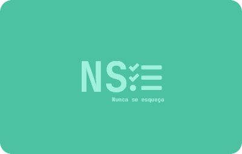
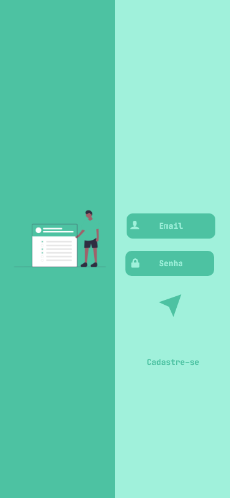
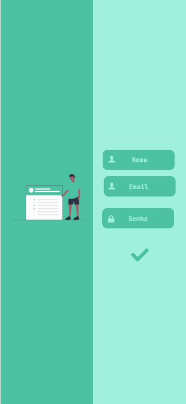
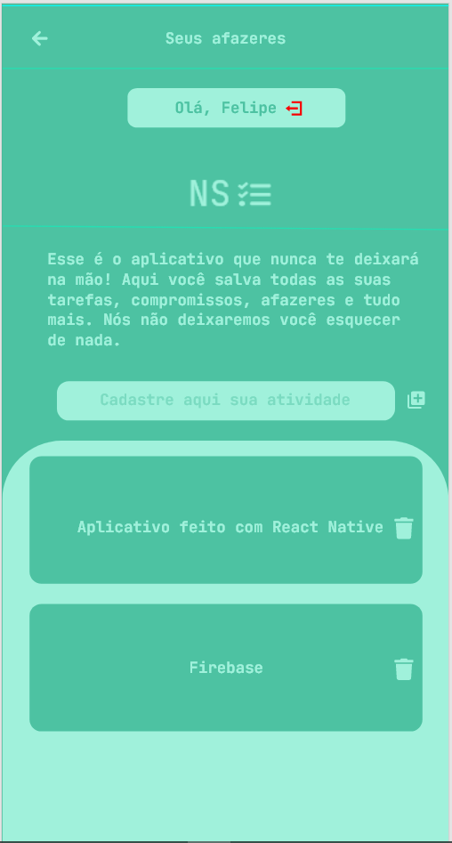

<h1 align="center">

<h1 align="center">Nunca se esqueça 
<h3 align='center'>O aplicativo que nunca te deixará esquercer! 📋</h3>
</h1>

Esse é o aplicativo que nunca te deixará na mão! Aqui você grava todas as suas tarefas, compromissos, afazeres e tudo mais. Nós não deixaremos você esquercer de nada.

<h3 align="center"> A finalidade desse aplicativo é torna sua vida mais organizada e com pouca margem de esquecimento. Apos criar sua conta, cadastre suas tarefas, atividade, afazeres e tudo mais. Assim, nós deixaremos salvos todos os compromissos. 🥰

<h4 align="center">Agora veja como ficou o aplicativo pronto e todas as tecnologias que foram utilizadas no desenvolvimento. 🤖

<h3 align="center"> Tela de login do usuario 🔓

<h3 align="center"> Tela de cadastro do usuario 🔒

<h3 align="center"> Tela principal do Aplicativo 📝

<h1 align="center">🚧 Aplicativo Concluido.
<h3 align="center">Conteúdo para meu portifólio</h3>

 Um aplicação desafiadora, onde consegui colocar todos os conhecimentos que venho adquirindo nesse pouco tempo estudando programação mobile 😜

<h2 align="center">🚀 Tecnologias</h2>

Abaixo deixarei todas as tecnlogias que foram usadas no desenvolvimento do aplicativo

🔨 React Native

🔨 Firebase

🔨 React Navigation

🔨 Date FNS

🔨 React Native Modalize

<h3 align="center">Desenvolvido por Felipe Costa 🙉